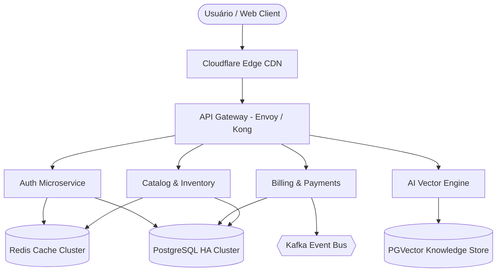

# ⚡ PulseOps — Plataforma de Observabilidade e Monitoramento de APIs em Tempo Real

[](https://react.dev/)
[](https://www.typescriptlang.org/)
[](https://vitejs.dev/)
[](https://modelcontextprotocol.io/)
[](https://github.com/)
[](LICENSE)

> **PulseOps** é uma plataforma moderna e de alta performance de observabilidade e monitoramento voltada para sistemas distribuídos, contratos de APIs, análise percentil de latência (p50, p95, p99) e gestão proativa de incidentes (SRE).

---

## 📸 Demonstração das Funcionalidades

### 1. 📊 Telemetria de Latência Percentil em Tempo Real
- Renderização de séries temporais em SVG com taxas de atualização a 60 FPS.
- Visualização de **p50 (mediana)**, **p95** e **p99 (cauda longa de latência)** com hover tooltip dinâmico.
- Seletor de timeframes e alternância granular de métricas.

### 2. 🛡️ Monitor de Endpoints & Contratos de SLA
- Acompanhamento de disponibilidade (meta de 99.9% de SLA) e consumo de **Error Budget**.
- Histórico visual segmentado de sondagens dos últimos 90 dias.
- Botão interativo para testes de ping instantâneos com simulação de latência e TTFB.

### 3. ⚡ Sonda Sintética de HTTP no Navegador
- Permite disparar requisições HTTP reais diretamente do navegador (com endpoints públicos como GitHub API, HTTPBin ou JSONPlaceholder).
- Medição precisa de **Time to First Byte (TTFB)**, latência de transporte e inspeção completa dos headers de resposta.

### 4. 📜 Console de Logs Distribuídos & Correlação de Traces
- Streaming contínuo de logs simulando microsserviços empresariais (`api-gateway`, `auth-service`, `billing-service`, `ai-inference`, `kafka-consumer`).
- Filtros por severidade (`INFO`, `WARN`, `ERROR`, `DEBUG`, `CRITICAL`) e pesquisa contextual.
- Inspeção de payloads JSON estruturados e cópia de **Trace IDs** com um clique para rastreamento distribuído.

### 5. 🌐 Topologia da Arquitetura & Malha de Microsserviços
- Mapa visual de dependências upstream e downstream entre serviços de borda (CDN Cloudflare), gateways (Envoy/Kong), bancos de dados (PostgreSQL HA, PGVector), caches (Redis) e filas (Kafka).
- Detalhamento de vazão (RPS/QPS), latência intra-serviço e taxa de erro 5xx.

### 6. 🔥 Engenharia do Caos & Central de Incidentes (SRE)
- Injeção simulada de falhas críticas (**P1 - Cascading Failure no Gateway Envoy**).
- Diagnóstico automático de causa raiz, plano de mitigação e impacto no SLA.
- Fluxo de ciclo de vida de incidentes: **Investigando ➔ Identificado (ACK) ➔ Em Monitoramento ➔ Resolvido**.
- Exportação instantânea de relatório de **Post-Mortem em Markdown**.

### 7. 🤖 AIOps & Triagem Determinística via Laya MCP (Model Context Protocol)
- Elimina a fadiga de alertas em ambientes de alta vazão executando decisões de **Sistema-1** em menos de **35ms**.
- **Zero Alucinações:** Retorna decisões estritamente tipadas com probabilidade calibrada de confiança (`calibrated confidence`).
- Classificação automática de categoria de anomalia, portão de urgência de SLA (`is_urgent`), score de severidade (0 a 3) e predição de risco de outage.
- Geração instantânea de comando de mitigação e playbook de remediação para Kubernetes/Envoy/PostgreSQL.

---

## 🏛️ Arquitetura do Sistema



---

## 🛠️ Stack Tecnológica

- **Frontend Core:** React 19, TypeScript (Strict Mode)
- **Build Tool:** Vite 8
- **Design System:** Glassmorphism, CSS Custom Properties (Tokens), Syne & Plus Jakarta Sans typography, JetBrains Mono
- **Visualização de Dados:** SVG puro de alta performance com interpolação de curvas lineares e gradientes
- **Ícones:** Lucide React & Custom Brand SVGs

---

## 🚀 Como Executar o Projeto Localmente

### Pré-requisitos
- Node.js (v18 ou superior recomendado)
- npm ou pnpm

### Passos:

```bash
# 1. Clone o repositório
git clone https://github.com/VictorFonseca-01/PulseOps-Plataforma-de-Observabilidade-e-Monitoramento-de-APIs-em-Tempo-Real.git

# 2. Acesse a pasta do projeto
cd PulseOps-Plataforma-de-Observabilidade-e-Monitoramento-de-APIs-em-Tempo-Real

# 3. Instale as dependências
npm install

# 4. Inicie o servidor de desenvolvimento
npm run dev
```

Acesse no navegador: `http://localhost:5173`

### Build para Produção

```bash
npm run build
npm run preview
```

---

## 💼 Publicação no LinkedIn & Portfólio

Dentro da aplicação, clique no botão **"LinkedIn & Git"** no cabeçalho para acessar:
1. **Texto pronto para postagem no LinkedIn** formatado para chamar a atenção de recrutadores, gerentes de engenharia e tech leads.
2. **Dica para gravação de demonstração em vídeo (15-30s)** mostrando a telemetria ao vivo e o teste de injeção de caos (P1).

---

## 📄 Licença

Distribuído sob a licença MIT. Veja `LICENSE` para mais informações.
